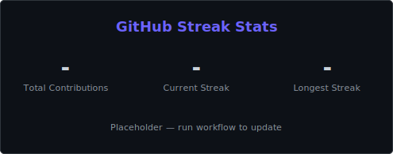
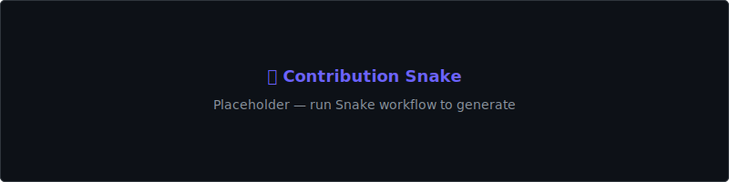

<!-- Header Banner -->

  

## Hello

<table>
<tr>
<td>

  

</td>
<td width="200" align="right">
  
</td>
</tr>
</table>

---

### About Me

I am Navjinder Singh — a Data Scientist focused on building reliable machine-learning models, clean data pipelines, and actionable data products. I enjoy solving real-world problems with data, clear visual storytelling, and writing maintainable code.

- 🔭 Currently working on predictive analytics and ML projects  
- 🌱 Exploring deep learning and NLP  
- 📫 Reach me: navjindersingh.in@gmail.com

---

### Skills & Technologies

<table width="100%" align="center" border="0" cellspacing="0" cellpadding="10">
  <tr>
    <td align="center"></td>
    <td align="center"></td>
    <td align="center"></td>
    <td align="center"></td>
  </tr>
  <tr>
    <td align="center"></td>
    <td align="center"></td>
    <td align="center"></td>
    <td align="center"></td>
  </tr>
  <tr>
    <td align="center"></td>
    <td align="center"></td>
    <td align="center"></td>
    <td align="center"></td>
  </tr>
  <tr>
    <td align="center"></td>
    <td align="center"></td>
    <td align="center"></td>
    <td align="center"></td>
  </tr>
</table>

---

### GitHub Streak

  

---

### Contribution Activity

  

---

### Contributions

  <picture>
    <source media="(prefers-color-scheme: dark)" srcset="output/github-contribution-grid-snake.svg" />
    <source media="(prefers-color-scheme: light)" srcset="output/github-contribution-grid-snake.svg" />
    
  </picture>

  🐍 Auto-generated by GitHub Actions — if missing, fallback: 

---

### Connect With Me

<table width="100%" align="center" border="0" cellspacing="0" cellpadding="10">
  <tr>
    <td align="center"></td>
    <td align="center"></td>
    <td align="center"></td>
    <td align="center"></td>
    <td align="center"></td>
    <td align="center"></td>
    <td align="center"></td>
    <td align="center"></td>
    <td align="center"></td>
    <td align="center"></td>
    <td align="center"></td>
  </tr>
</table>

---

  <i>"Keep learning, keep shipping — small steps every day."</i>

<!-- Clean and professional layout; all assets served locally for reliability -->
